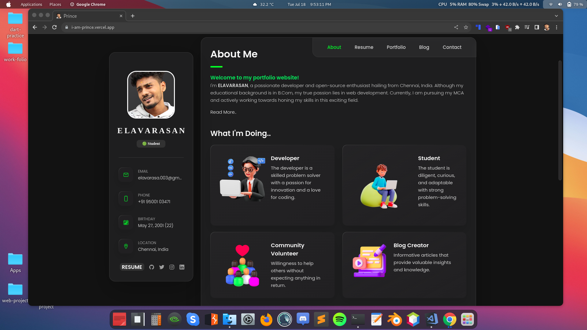

# WorkFolio

**Live Preview: 👉🏽 [elavarasan.me](https://elavarasan.me)**

✨ Hello there, I'm ELAVARASAN. This is my personal website, which contains public information that anyone can find on the internet.

## 🎬 Captured Moment

  

## Features

- Dynamic: The portfolio is dynamically generated, allowing for easy updates and additions to projects and skills.
- Responsive: The portfolio is designed to be responsive and accessible on different devices and screen sizes.

## Technologies Used

- HTML
- CSS
- JavaScript

## Setup and Usage

1. Clone the repository.
2. Open the `index.html` file in your web browser.

## How to Customize

To customize the portfolio for your own use, follow these steps:

1. Update the `projects` section in the `index.html` file with your own projects and information.
2. Modify the CSS styles in the `styles.css` file to match your desired design.
3. Add any additional pages or sections as needed.

## 💙 Contributing

If you find any issues with this branch or would like to suggest changes, feel free to submit a pull request or open an issue. Please make sure to follow the [Contributing Guidelines](https://github.com/follow-prince) before your contribution.

## ❤️ Thanks

Thanks to everyone who supported.

## 👨‍💻 Developed By

ELAVARASAN
[©elavarasan.dev](https://elavarasan.me)

## 💬 Contact

Send me an email if you need to contact me to discuss anything.  
Email - <elavarasa.003@gmail.com>
